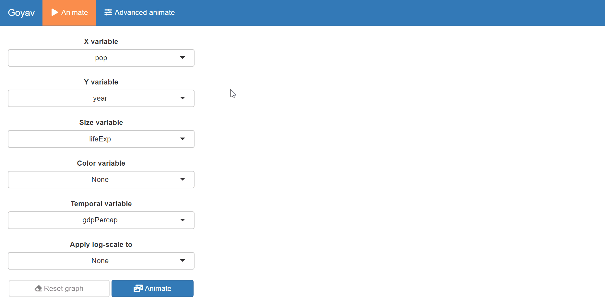
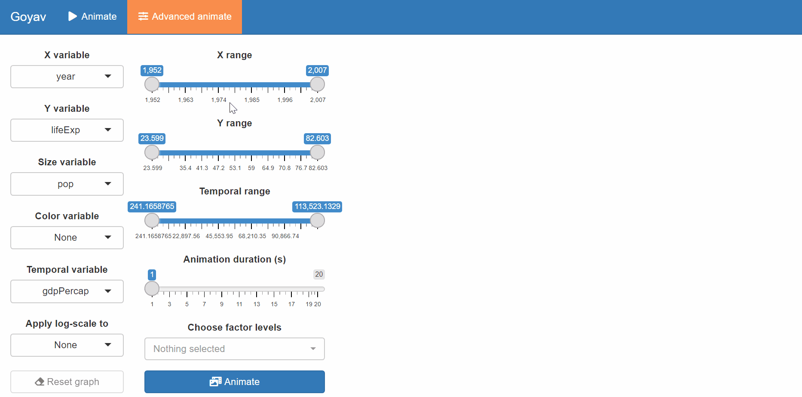

Tutorial: the `goyav` package
================
Antonin Vidon
10/29/2021

## Installation

The package is located on my
[GitHub](https://github.com/AntoninVidon/goyav). From the RStudio IDE,
You should install it with the `devtools` library using the following
lines of code.

``` r
# install 'devtools'
install.packages("devtools")

# import 'devtools'
library(devtools)

# install 'goyav' from github
install_github("AntoninVidon/goyav")
```

``` r
# import 'goyav'
library(goyav)
```

You may have to upgrade some of your packages in order to successfully
install `goyav`.

## The `goyav` package

### Description

`goyav` is a shiny App meant to generate GIF from tabular temporal data.
All customization of the animated plots is done in an interactive
window.

The dashboard of the application looks like this :

<!-- -->

The user is able to navigate into two tabs : “Animate” and “Advanced
animate”, the latter offering a wider range of customization.

From the *Animate* tab, you may choose the following :

-   X variable (numeric);
-   Y variable (numeric);
-   size variable (numeric);
-   color variable (factor);
-   temporal variable (numeric);
-   choose if you want to apply a log-scale to either X, Y or X and Y.

From the *Advanced animated* tab, you may choose the following :

-   X variable (numeric);
-   Y variable (numeric);
-   size variable (numeric);
-   color variable (factor);
-   temporal variable (numeric);
-   choose if you want to apply a log-scale to either X, Y or X and Y.
-   X range;
-   Y range;
-   Temporal range;
-   Animation duration (s);
-   Factors to include (for the color variable).

### Demonstration

In order to better show the use of the package, we will import and use
the `gapminder` dataset from the `gapminder` package.

``` r
# install `gapminder`
install.packages("gapminder")
```

``` r
# load `gapminder`
library(gapminder)

# display first rows of dataset
knitr::kable(head(gapminder))
```

| country     | continent | year | lifeExp |      pop | gdpPercap |
|:------------|:----------|-----:|--------:|---------:|----------:|
| Afghanistan | Asia      | 1952 |  28.801 |  8425333 |  779.4453 |
| Afghanistan | Asia      | 1957 |  30.332 |  9240934 |  820.8530 |
| Afghanistan | Asia      | 1962 |  31.997 | 10267083 |  853.1007 |
| Afghanistan | Asia      | 1967 |  34.020 | 11537966 |  836.1971 |
| Afghanistan | Asia      | 1972 |  36.088 | 13079460 |  739.9811 |
| Afghanistan | Asia      | 1977 |  38.438 | 14880372 |  786.1134 |

In order to be able to create any GIF, your dataframe should have
candidate columns for the following variables: X, Y, size and temporal.
Therefore, *calling the `goyav` function on a dataframe with less than 4
numeric variables will return an error*.

``` r
# try to call the `goyav` function on the first 3 columns of the `gapminder` dataset
goyav(gapminder[,1:3])
```

    ## Error in goyav(gapminder[, 1:3]): Your dataframe should have at least 4 numeric variables.

Let’s now call `goyav` on the whole dataset :

``` r
# call `goyav` on `gapminder`
goyav(gapminder)
```

#### View from the *Animate* tab

<!-- -->

#### View from the *Advanced animate* tab

<!-- -->
