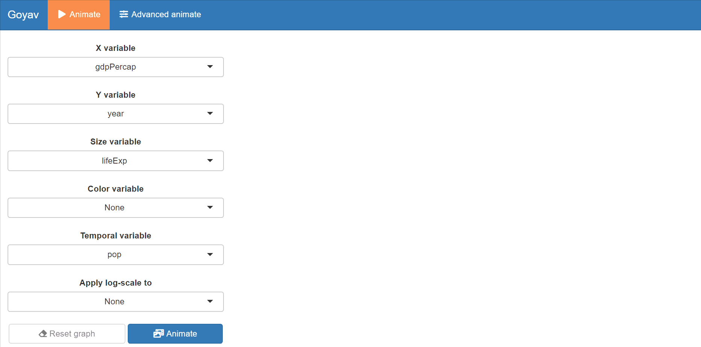

Tutorial: the ‘goyav’ package
================
Antonin Vidon
10/29/2021

## Installation

The package is located on GitHub. You should install it with the
`devtools` library using the following lines of code.

``` r
# install 'devtools'
install.packages("devtools")

# import 'devtools'
library(devtools)

# install 'goyav' from github
install_github("AntoninVidon/goyav")
```

``` r
# import 'goyav'
library(goyav)
```

## The `goyav` package

### Motivation

`goyav` is a shiny App meant to generate GIF from tabular temporal data.
All customization of the animated plots is done in an interactive
window.

The dashboard of the application looks like this :

<!-- -->

The user is able to navigate into two tabs : “Animate” and “Advanced
animate”, the latter offering a wider range of customization.

### Demonstration

In order to better show the use of the package, we will import and use
the `gapminder` dataset from the `gapminder` package.

``` r
# install `gapminder`
install.packages("gapminder")
```

``` r
# load `gapminder`
library(gapminder)
head(gapminder)
```

    ## # A tibble: 6 x 6
    ##   country     continent  year lifeExp      pop gdpPercap
    ##   <fct>       <fct>     <int>   <dbl>    <int>     <dbl>
    ## 1 Afghanistan Asia       1952    28.8  8425333      779.
    ## 2 Afghanistan Asia       1957    30.3  9240934      821.
    ## 3 Afghanistan Asia       1962    32.0 10267083      853.
    ## 4 Afghanistan Asia       1967    34.0 11537966      836.
    ## 5 Afghanistan Asia       1972    36.1 13079460      740.
    ## 6 Afghanistan Asia       1977    38.4 14880372      786.

The `goyav` package is a tool aiming at generating animated gifs from
temporal data. In order to create any gif, your dataframe should have
candidate columns for the following variables: X, Y, size and temporal.
Therefore, *calling the `goyav` function on a dataframe with less than 4
numeric variables will return an error*.

``` r
goyav(gapminder[,1:3])
```

    ## Error in goyav(gapminder[, 1:3]): Your dataframe should have at least 4 numeric variables.

## Including Plots

You can also embed plots, for example:

<!-- -->

Note that the `echo = FALSE` parameter was added to the code chunk to
prevent printing of the R code that generated the plot.
